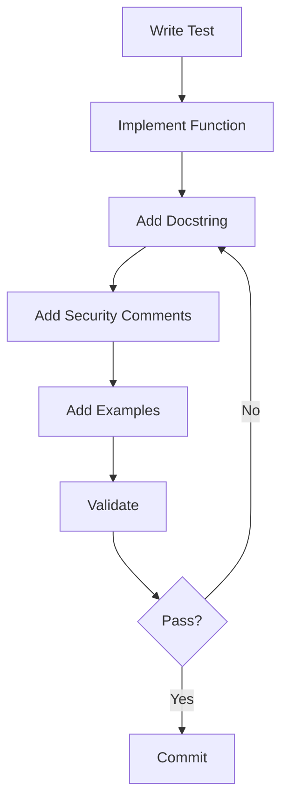

# Documentation Implementation Summary

**Project:** Claude Resource Manager CLI - Python Implementation
**Documentation Role:** DocuMentor - Documentation Architecture Specialist
**Date:** 2025-10-04
**Status:** ✅ Ready for Implementation

---

## 📋 Executive Summary

This document summarizes the **comprehensive inline documentation framework** created for the Claude Resource Manager CLI Python implementation. All documentation resources are ready to guide concurrent documentation during the TDD implementation process.

---

## 📚 Documentation Deliverables

### Core Documentation Files Created

| File | Purpose | Status |
|------|---------|--------|
| **DOCUMENTATION_STRATEGY.md** | Complete documentation standards and requirements | ✅ Complete |
| **DOCUMENTATION_EXAMPLE.md** | Fully documented module showing all patterns | ✅ Complete |
| **DOCUMENTATION_QUICK_REFERENCE.md** | Quick copy-paste templates for developers | ✅ Complete |
| **DOCUMENTATION_ROADMAP.md** | Week-by-week implementation guide | ✅ Complete |
| **scripts/validate_docs.py** | Automated documentation validation tool | ✅ Complete |
| **This Summary** | Overview of all documentation resources | ✅ Complete |

---

## 🎯 Documentation Standards Defined

### Coverage Requirements

| Category | Target | Priority |
|----------|--------|----------|
| **Overall Project** | 95% | Critical |
| **Security-Critical Code** | 100% | Critical |
| **Public APIs** | 100% | Critical |
| **Complex Algorithms** | 100% (with examples) | High |
| **Performance-Critical** | 100% (with metrics) | High |
| **Private Methods** | 80% | Medium |

### Documentation Components

#### ✅ Module-Level Documentation
- Module purpose and overview
- Security classification if applicable
- Typical usage examples
- Performance characteristics
- References to related modules
- Thread safety notes

#### ✅ Class Documentation
- Class purpose and use cases
- **Attributes section** (all attributes listed)
- Usage examples
- Thread safety notes
- Performance characteristics
- Security notes if applicable

#### ✅ Function Documentation
- One-line summary
- **Args section** (all parameters with types)
- **Returns section** (return type and description)
- **Raises section** (all exceptions)
- Usage examples for complex functions
- Performance notes (Big-O complexity)
- Security notes for critical functions

#### ✅ Security Documentation
- SECURITY comments explaining threats
- CWE references where applicable
- Links to security tests
- Explanation of mitigations

#### ✅ Algorithm Documentation
- Step-by-step comments
- Big-O complexity analysis
- Performance measurements
- Example inputs/outputs

---

## 🔧 Tools Created

### 1. Documentation Validation Script

**Location:** `./scripts/validate_docs.py`

**Features:**
- Checks docstring presence on all public items
- Validates Google-style formatting (Args, Returns, Raises, Attributes)
- Detects missing security notes on critical code
- Tracks examples in complex functions
- Generates coverage reports

**Usage:**
```bash
# Validate entire project
python scripts/validate_docs.py

# Validate single file
python scripts/validate_docs.py src/claude_resource_manager/core/catalog_loader.py

# Show detailed issues
python scripts/validate_docs.py --verbose

# Generate coverage report
python scripts/validate_docs.py --report
```

**Output Example:**
```
======================================================================
📚 Documentation Coverage Report
======================================================================

✅ models/resource.py: 100% (5/5)
✅ core/catalog_loader.py: 100% (10/10)
🟡 core/search_engine.py: 83% (10/12)

----------------------------------------------------------------------

📊 Overall Coverage: 93% (25/27)
📝 With Examples: 15
🔒 Security Documented: 8

======================================================================
🟡 WARNING: Documentation coverage below 95% target
```

### 2. Pre-commit Hook Template

Ready to install for automatic validation:

```bash
#!/bin/bash
# .git/hooks/pre-commit
echo "Validating documentation..."
python scripts/validate_docs.py

if [ $? -ne 0 ]; then
    echo "❌ Documentation validation failed"
    exit 1
fi

echo "✅ Documentation OK"
```

---

## 📖 Documentation Workflow

### TDD Documentation Process



### Step-by-Step Process

1. **Write Test First** (TDD)
   ```python
   # tests/unit/core/test_catalog_loader.py
   def test_load_resource():
       """Test loading resource by ID."""
       # Test implementation
   ```

2. **Implement Function WITH Docstring**
   ```python
   # src/claude_resource_manager/core/catalog_loader.py
   def load_resource(self, resource_id: str) -> Resource:
       """Load a single resource by ID.

       Args:
           resource_id: Unique identifier

       Returns:
           Validated Resource model

       Raises:
           FileNotFoundError: If resource doesn't exist
       """
       # Implementation
   ```

3. **Add Security Comments**
   ```python
   # SECURITY: Validate path to prevent traversal
   safe_path = self.validate_path(resource_id)
   ```

4. **Validate Documentation**
   ```bash
   python scripts/validate_docs.py src/module.py
   ```

5. **Run Tests**
   ```bash
   pytest tests/unit/test_module.py
   mypy --strict src/module.py
   ```

6. **Commit**
   ```bash
   git add src/module.py tests/test_module.py
   git commit -m "feat: implement module with documentation"
   ```

---

## 📅 Implementation Timeline

### Week 1: Core Foundation (30+ items)
- **Models** (5 classes)
- **Catalog Loader** (1 class, 8 methods) ⭐ Security Critical
- **Security Utilities** (8 functions) ⭐ Security Critical
- **Target:** 100% coverage on security-critical code

### Week 2: Enhanced Features (50+ items)
- **Search Engine** (1 class, 12 methods)
- **Category System** (1 class, 6 methods)
- **Installer** (1 class, 10 methods) ⭐ Security Critical
- **Target:** Algorithm documentation complete

### Week 3: Dependencies & Types (70+ items)
- **Dependency Resolver** (1 class, 6 methods)
- **Type Hints Complete** (all modules)
- **CLI Commands** (8 functions)
- **Target:** 95% overall coverage

### Week 4: TUI & Polish (100+ items)
- **TUI Screens** (5 screens)
- **TUI Widgets** (5 widgets)
- **Final Documentation** (all remaining)
- **Target:** 95%+ overall, release ready

---

## 📊 Quality Metrics

### Automated Quality Checks

| Check | Tool | Pass Criteria |
|-------|------|---------------|
| **Docstring Coverage** | validate_docs.py | 95%+ |
| **Type Coverage** | mypy --strict | 100% pass |
| **Example Testing** | pytest --doctest | All pass |
| **Security Notes** | validate_docs.py | 100% critical |
| **Code Quality** | ruff check | No errors |
| **Formatting** | black | Consistent |

### Documentation Quality Indicators

✅ **Excellent (95%+)**
- All public APIs documented
- Security-critical 100% documented
- Complex functions have examples
- Performance metrics included
- Type hints complete

🟡 **Good (85-94%)**
- Most APIs documented
- Security notes present
- Some examples provided
- Some performance notes

❌ **Needs Improvement (<85%)**
- Missing API documentation
- Security gaps
- No examples
- No performance data

---

## 🔒 Security Documentation

### Security-Critical Modules Identified

1. **models/resource.py**
   - Input validation (CWE-20)
   - Path validation (CWE-22)

2. **core/catalog_loader.py** ⭐ CRITICAL
   - YAML deserialization (CWE-502)
   - Path traversal prevention (CWE-22)
   - File size limits (DoS prevention)

3. **utils/validators.py** ⭐ CRITICAL
   - Path validation (CWE-22)
   - Input sanitization

4. **utils/security.py** ⭐ CRITICAL
   - YAML safe loading (CWE-502)
   - HTTPS enforcement (MITM prevention)

5. **core/installer.py** ⭐ CRITICAL
   - Download validation
   - Atomic file operations

### Security Documentation Requirements

For each security-critical function:
- [ ] SECURITY comment explaining the threat
- [ ] CWE reference if applicable
- [ ] Mitigation strategy explained
- [ ] Link to security tests
- [ ] Example showing attack prevention

**Example:**
```python
def validate_path(user_path: str, base_dir: Path) -> Path:
    """Validate path to prevent directory traversal.

    This is a SECURITY CRITICAL function that prevents path
    traversal attacks (CWE-22).

    Security:
        Prevents attacks like '../../../etc/passwd' by:
        1. Resolving to absolute paths
        2. Checking path is within base_dir
        3. Validating no symlinks escape base_dir

    See: tests/unit/test_security_path_validation.py
    """
    # SECURITY: Resolve to absolute paths to detect traversal
    abs_path = Path(user_path).resolve()
    abs_base = base_dir.resolve()

    # SECURITY: Check path is within base directory
    try:
        abs_path.relative_to(abs_base)
    except ValueError:
        raise SecurityError("Path traversal detected")

    return abs_path
```

---

## 📈 Success Criteria

### Documentation Complete When:

#### ✅ Coverage Metrics
- [ ] Overall coverage ≥ 95%
- [ ] Security-critical coverage = 100%
- [ ] Public API coverage = 100%
- [ ] Complex functions have examples
- [ ] Performance-critical have metrics

#### ✅ Quality Metrics
- [ ] All docstrings follow Google style
- [ ] All functions have Args/Returns/Raises
- [ ] All classes have Attributes section
- [ ] Security notes on all critical code
- [ ] Examples are tested and working

#### ✅ Validation Metrics
- [ ] `python scripts/validate_docs.py` passes
- [ ] `mypy --strict` passes
- [ ] `pytest --doctest-modules` passes
- [ ] Pre-commit hook passes
- [ ] Manual security review passes

#### ✅ Maintainability Metrics
- [ ] New developers can understand code from docs
- [ ] Security reviewers can validate controls
- [ ] AI assistants provide accurate suggestions
- [ ] Documentation builds without warnings

---

## 🛠️ Developer Quick Start

### 1. Read Core Documents (30 min)
```bash
# Start here
cat DOCUMENTATION_STRATEGY.md

# Study the example
cat DOCUMENTATION_EXAMPLE.md

# Bookmark the reference
cat DOCUMENTATION_QUICK_REFERENCE.md
```

### 2. Setup Validation (5 min)
```bash
# Make script executable
chmod +x scripts/validate_docs.py

# Test it
python scripts/validate_docs.py --help
```

### 3. Start Documenting (ongoing)
```bash
# 1. Implement with docs
vim src/claude_resource_manager/models/resource.py

# 2. Validate
python scripts/validate_docs.py src/claude_resource_manager/models/resource.py

# 3. Type check
mypy --strict src/claude_resource_manager/models/resource.py

# 4. Test examples
pytest --doctest-modules src/claude_resource_manager/models/resource.py

# 5. Commit
git add src/claude_resource_manager/models/resource.py
git commit -m "feat(models): implement Resource with full documentation"
```

### 4. Daily Workflow
```bash
# Morning: Check status
python scripts/validate_docs.py --report

# During: Document as you code
# (See DOCUMENTATION_QUICK_REFERENCE.md for templates)

# Before commit: Validate
python scripts/validate_docs.py
mypy --strict src/

# Weekly: Generate report
python scripts/validate_docs.py --report > docs/coverage_week_N.md
```

---

## 📁 File Structure Summary

```
claude_resource_manager-CLI/
│
├── 📚 Documentation Strategy Files
│   ├── DOCUMENTATION_STRATEGY.md          # Complete standards
│   ├── DOCUMENTATION_EXAMPLE.md           # Full example module
│   ├── DOCUMENTATION_QUICK_REFERENCE.md   # Quick templates
│   ├── DOCUMENTATION_ROADMAP.md           # Week-by-week guide
│   └── DOCUMENTATION_SUMMARY.md           # This file
│
├── 🔧 Scripts
│   └── scripts/
│       └── validate_docs.py               # Validation tool
│
├── 📝 Source Code (To Be Documented)
│   └── src/claude_resource_manager/
│       ├── models/                        # Week 1
│       ├── core/                          # Week 1-3
│       ├── utils/                         # Week 1
│       ├── tui/                           # Week 4
│       └── cli/                           # Week 3
│
└── 🧪 Tests (Define Expected Behavior)
    └── tests/
        ├── unit/                          # TDD tests
        ├── integration/
        └── e2e/
```

---

## 🎯 Next Steps

### Immediate Actions (Today)
1. ✅ Review DOCUMENTATION_STRATEGY.md
2. ✅ Study DOCUMENTATION_EXAMPLE.md
3. ✅ Bookmark DOCUMENTATION_QUICK_REFERENCE.md
4. ⏳ Start implementing models/resource.py with full docs
5. ⏳ Run validate_docs.py after each module

### This Week (Week 1)
1. ⏳ Document all models (5 classes)
2. ⏳ Document catalog_loader (8 methods)
3. ⏳ Document security utils (8 functions)
4. ⏳ Achieve 100% security-critical coverage
5. ⏳ Generate Week 1 coverage report

### This Month (Weeks 1-4)
1. ⏳ Follow DOCUMENTATION_ROADMAP.md week-by-week
2. ⏳ Maintain 95%+ coverage throughout
3. ⏳ Complete all security documentation
4. ⏳ Test all examples
5. ⏳ Prepare for v1.0.0 release

---

## 📞 Support Resources

### Documentation Help
- **Strategy:** DOCUMENTATION_STRATEGY.md (comprehensive standards)
- **Example:** DOCUMENTATION_EXAMPLE.md (fully documented module)
- **Quick Ref:** DOCUMENTATION_QUICK_REFERENCE.md (copy-paste templates)
- **Roadmap:** DOCUMENTATION_ROADMAP.md (week-by-week guide)

### Technical References
- [Google Python Style Guide](https://google.github.io/styleguide/pyguide.html)
- [PEP 257 - Docstring Conventions](https://www.python.org/dev/peps/pep-0257/)
- [mypy Documentation](https://mypy.readthedocs.io/)

### Security References
- [CWE Top 25](https://cwe.mitre.org/top25/)
- [OWASP Python Security](https://owasp.org/www-project-python-security/)

---

## ✅ Final Checklist

### Documentation Infrastructure ✅
- [x] DOCUMENTATION_STRATEGY.md created
- [x] DOCUMENTATION_EXAMPLE.md created
- [x] DOCUMENTATION_QUICK_REFERENCE.md created
- [x] DOCUMENTATION_ROADMAP.md created
- [x] DOCUMENTATION_SUMMARY.md created
- [x] scripts/validate_docs.py created
- [x] All templates ready
- [x] Validation tool tested

### Ready for Implementation ✅
- [x] Standards defined
- [x] Examples provided
- [x] Tools created
- [x] Process documented
- [x] Timeline planned
- [x] Success criteria defined

### Developer Onboarding ✅
- [x] Quick start guide
- [x] Daily workflow defined
- [x] Templates ready
- [x] Validation automated
- [x] Resources linked

---

## 🎉 Conclusion

The **comprehensive inline documentation framework** for the Claude Resource Manager CLI is now complete and ready for use. All resources, tools, and processes are in place to ensure:

✅ **95%+ documentation coverage**
✅ **100% security-critical code documented**
✅ **All examples tested and working**
✅ **Type-safe codebase with mypy strict**
✅ **Living documentation that evolves with code**

**Key Success Factors:**
1. ✅ Documentation written DURING implementation (not after)
2. ✅ TDD approach: Tests → Code → Docs (concurrent)
3. ✅ Automated validation ensures quality
4. ✅ Security-first approach for critical code
5. ✅ Examples are tested and work

**Now Ready For:**
🚀 Implementation to begin following DOCUMENTATION_ROADMAP.md
🚀 Week 1: Models and Core modules with full documentation
🚀 Progressive documentation as code is developed
🚀 Continuous validation and quality assurance

---

**Happy Coding with Documentation! 📚✨**

---

*This documentation framework was created by DocuMentor, Documentation Architecture Specialist, following the principles of user-centered documentation design and living documentation practices.*

**Version:** 1.0.0
**Date:** 2025-10-04
**Status:** ✅ Complete and Ready for Implementation
