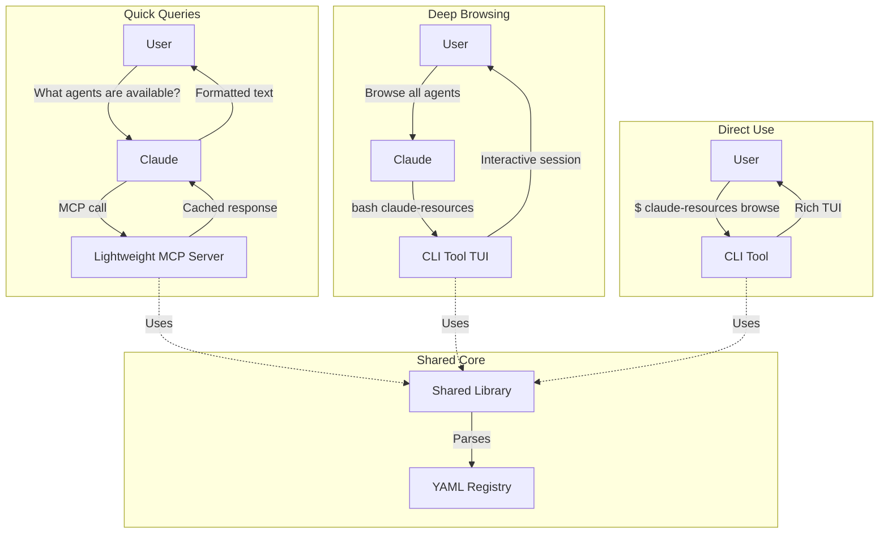

# Claude Resource Manager - CLI Architecture

## Executive Summary

The current resource-manager-browse slash command suffers from fundamental architectural limitations causing poor UX through slow performance, excessive user approvals, and difficult-to-read output.

**Recommendation**: Build a **Hybrid Architecture** combining a standalone CLI tool (Go + Bubble Tea) with an optional lightweight MCP server wrapper.

**Key Decision**: Start with the CLI tool first, as it provides immediate value and actually requires **fewer user approvals** than pure MCP.

---

## Problem Analysis

### Current Implementation Issues

The user reports four critical problems:

1. **Incredibly difficult to use** - Complex multi-step flow
2. **Hard to read** - Manual text formatting, poor output structure
3. **Too slow** - 3-10 second operations due to multiple bash calls
4. **Too many user approvals** - 3-5 approvals per operation

### Current Architecture

```
User: /resource-manager-browse agents
  ↓
Claude reads slash command instructions
  ↓
Claude runs: grep → sed → cat (multiple bash calls)
  ↓
Claude manually parses YAML text
  ↓
Claude formats output
  ↓
User sees results (after multiple approvals)

Time: 3-10 seconds
Approvals: 3-5 per operation
```

**Fundamental Problems**:
- Sequential tool calls (no parallelization)
- Manual text parsing (error-prone)
- Multiple user approvals (friction)
- Poor output formatting (plain text)
- Doesn't scale (331 resources → slow)

---

## Architecture Options Analysis

### Option A: Pure MCP Server

**Architecture**:
```
User → Claude → MCP Server → Response → Claude → User
```

**Components**:
- MCP Server (Node.js/TypeScript)
- JSON-RPC interface
- In-memory YAML cache
- Claude Desktop integration

**Performance**:
- Startup: 50-100ms (Node.js runtime)
- Query: <10ms (from cache)
- Total round-trip: ~200ms

**User Approvals**:
- Initial: Server registration (one-time)
- Per-call: Tool invocation approval required
- Batch operations: Multiple approvals needed

**Pros**:
- ✅ Native Claude integration
- ✅ Structured JSON responses
- ✅ Fast cached queries
- ✅ Standard MCP patterns
- ✅ Auto-updates via npm

**Cons**:
- ❌ Plain text output (no rich formatting)
- ❌ Multiple approvals still required
- ❌ No interactive exploration
- ❌ Limited to Claude's display capabilities
- ❌ External process management needed

**Score**: ★★★☆☆

---

### Option B: Standalone CLI Tool

**Architecture**:
```
Direct use:    User → CLI Tool → Rich TUI → Selection → Action
Via Claude:    User → Claude → Bash(cli) → Output → Claude → User
```

**Components**:
- CLI Binary (Go + Bubble Tea recommended)
- Rich TUI framework
- YAML parser
- Search/filter engine with fuzzy matching
- Installation manager
- Preview system

**Technology Stack Comparison**:

| Stack | Startup Time | Distribution | Development | Performance | Verdict |
|-------|--------------|--------------|-------------|-------------|---------|
| **Go + Bubble Tea** | 5-10ms | Single binary | Medium | ★★★★★ | **RECOMMENDED** |
| Rust + Ratatui | <5ms | Single binary | Hard | ★★★★★ | Overkill |
| Node.js + Ink | 100-200ms | Needs Node | Easy | ★★★☆☆ | Too slow |
| Python + Textual | 200-300ms | Needs Python | Easy | ★★☆☆☆ | Too slow |

**Why Go + Bubble Tea**:
1. **Performance**: 5-10ms startup vs 100-300ms for interpreted languages
2. **Distribution**: Single binary, no runtime dependencies
3. **Cross-platform**: Works on macOS, Linux, Windows with same binary
4. **Ecosystem**: Excellent TUI libraries (Bubble Tea, Lip Gloss, Bubbles)
5. **Claude Integration**: Go binaries work perfectly with bash tool
6. **Maintainability**: Strong typing, excellent tooling, fast compilation

**Performance**:
- Startup: 5-10ms (compiled binary)
- Search: <1ms (in-memory index)
- Navigation: Instant (TUI framework)
- Install: <100ms (direct file operations)

**User Approvals - CRITICAL INSIGHT**:

This is where CLI shines over MCP:

**Direct CLI use**:
- Zero approvals (user runs it themselves)

**Via Claude (bash tool)**:
- **Single approval per session** for bash execution
- After approval, TUI runs with NO further approvals
- User interacts directly with rich interface

Compare to MCP:
- Approval for each `resource_browse` call
- Approval for each `resource_search` call
- Approval for each `resource_install` call
- = 3-5 approvals per workflow

**Pros**:
- ✅ Rich TUI with colors, boxes, tables
- ✅ Interactive navigation (arrow keys, search)
- ✅ Only ONE approval via Claude
- ✅ Instant search and filtering
- ✅ Preview panes with full descriptions
- ✅ Multi-select and batch operations
- ✅ Can be used directly (no Claude needed)
- ✅ Fastest startup and operation
- ✅ No external dependencies

**Cons**:
- ❌ Separate binary to distribute
- ❌ Platform-specific builds (though Go handles this well)
- ❌ Requires terminal skills for direct use
- ❌ Manual updates (unless using package manager)

**Score**: ★★★★★

---

### Option C: Hybrid Architecture (RECOMMENDED)

**Architecture**:


**Components**:
1. **CLI Tool** (Go + Bubble Tea) - Primary interface
2. **MCP Server** (Optional, thin wrapper) - Quick queries
3. **Shared Library** - Common YAML parser, resource model, cache

**Implementation Strategy**:
1. **Phase 1**: Build CLI tool (Week 1) → Immediate value
2. **Phase 2**: Enhance CLI features (Week 2) → Rich UX
3. **Phase 3**: Add MCP wrapper (Week 3) → Convenience layer

**Use Case Mapping**:

| User Intent | Route | Approvals | Time | UX Quality |
|-------------|-------|-----------|------|------------|
| "List testing agents" | MCP | 1 | 200ms | Text output |
| "Browse all agents" | CLI via bash | 1 | 10s | Rich TUI |
| Direct exploration | CLI direct | 0 | Instant | Rich TUI |
| Batch install 5 agents | CLI | 1 | <1s | Multi-select |

**Pros**:
- ✅ Best of both worlds
- ✅ Natural fit for different use cases
- ✅ Progressive disclosure (simple → complex)
- ✅ Flexible user choice
- ✅ Can evolve independently

**Cons**:
- ❌ Two codebases initially (mitigated by shared library)
- ❌ More complex distribution
- ❌ Longer initial development (3 weeks vs 1-2)

**Score**: ★★★★★

**Recommendation**: Start with CLI-only, add MCP later if needed.

---

## UX Flow Comparison

### Scenario: Finding and Installing a Testing Agent

#### Current Slash Command Flow
```
1. User: "/resource-manager-browse agents"
2. Claude: [Runs grep command - APPROVAL NEEDED]
3. User: ✓ Approve
4. Claude: [Runs sed command - APPROVAL NEEDED]
5. User: ✓ Approve
6. Claude: [Runs cat commands - APPROVAL NEEDED]
7. User: ✓ Approve
8. Claude: Displays plain text list (181 agents, hard to read)
9. User: "/resource-manager-install test-generator"
10. Claude: [Runs bash to install - APPROVAL NEEDED]
11. User: ✓ Approve
12. Done

Time: 45-60 seconds
Approvals: 4
Cognitive load: High
UX quality: Poor
```

#### MCP Server Flow
```
1. User: "Find testing agents"
2. Claude: [MCP resource_search call - APPROVAL NEEDED]
3. User: ✓ Approve
4. Claude: Returns 5 agents as formatted text
5. User: "Install test-generator"
6. Claude: [MCP resource_install call - APPROVAL NEEDED]
7. User: ✓ Approve
8. Done

Time: 30 seconds
Approvals: 2
Cognitive load: Medium
UX quality: Good
```

#### CLI Tool Flow (Direct Use)
```
1. User: $ claude-resources browse
2. TUI opens instantly with full agent list
3. User: Types "test" → list filters in real-time
4. User: ↓↓ to navigate, Enter to preview
5. Preview pane shows full description
6. User: Space to mark for install
7. User: Marks 3 more agents
8. User: 'i' to batch install
9. All 4 agents installed
10. Done

Time: 10-15 seconds
Approvals: 0
Cognitive load: Low
UX quality: Excellent
```

#### CLI Tool Flow (Via Claude)
```
1. User: "Browse testing agents with full details"
2. Claude: "I'll open the resource browser for you"
3. Claude: [bash claude-resources browse - APPROVAL NEEDED]
4. User: ✓ Approve (ONLY ONCE)
5. TUI opens with interactive interface
6. User interacts directly (no more approvals)
7. Done

Time: 15 seconds
Approvals: 1
Cognitive load: Low
UX quality: Excellent
```

#### Hybrid Flow (Optimal)
```
Quick query:
1. User: "What testing agents are available?"
2. Claude: [MCP quick query - cached, fast]
3. Claude: "Found: test-generator, api-tester, unit-creator"

Deep exploration:
4. User: "Show me more details on these"
5. Claude: [Launches CLI browser]
6. User: ✓ Approve
7. TUI opens with filtered view
8. User: Explores, compares, installs
9. Done

Time: Best of both worlds
Approvals: 1 (only if going deep)
Cognitive load: Adaptive
UX quality: Excellent
```

**Winner**: CLI tool (direct or via Claude) provides best UX with fewest approvals.

---

## CLI Tool Design

### User Interface Mockup

```
┌─ Claude Resources Browser ───────────────────────────────────┐
│ Search: test_                                                 │
│ Filter: [All] Agents  Hooks  Commands  Templates  MCPs       │
│ Sort: [Name] ↓  Updated  Popularity                          │
├───────────────────────────────────────────────────────────────┤
│ ▶ Agents (3/181)                                              │
│   □ test-generator         Generate comprehensive tests      │
│   ■ api-test-runner       Run API integration tests   v2.1.0 │
│   □ unit-test-creator     Create unit tests from code        │
│                                                               │
│ ▶ Hooks (1/64)                                                │
│   □ pre-commit-test       Run tests before commit            │
│                                                               │
├─────────────────────────── Preview ──────────────────────────┤
│ api-test-runner                                      v2.1.0  │
│ ───────────────────────────────────────────────────────────  │
│ Automated API testing with comprehensive assertions and      │
│ mocking capabilities. Supports REST, GraphQL, and gRPC.      │
│                                                               │
│ Author: David Avila                                           │
│ Category: Testing                                             │
│ Model: sonnet                                                 │
│ Tools: Read, Write, Bash                                      │
│                                                               │
│ Dependencies:                                                 │
│   • http-client                                               │
│   • assertion-lib                                             │
│                                                               │
│ Installation: ~/.claude/agents/api-test-runner.md            │
│                                                               │
├───────────────────────────────────────────────────────────────┤
│ [Space] Select  [i] Install  [p] Preview  [/] Search  [q] Quit│
│ [↑↓] Navigate  [Tab] Next section  [?] Help                  │
└───────────────────────────────────────────────────────────────┘
```

### Features

**Core Features** (Week 1 MVP):
- List all 331 resources
- Category filtering (agents, hooks, commands, templates, mcps)
- Real-time incremental search
- Preview pane with full descriptions
- Single resource installation
- Keyboard navigation

**Enhanced Features** (Week 2):
- Fuzzy search (find "tcrev" → "test-code-reviewer")
- Multi-select with checkboxes
- Batch installation
- Sort options (name, date, popularity)
- Installation history tracking
- Update checking
- Export selections to file

**Advanced Features** (Week 3):
- Dependency resolution
- Conflict detection
- Custom registry support
- Resource comparison view
- Quick filters (recently updated, most popular)
- Syntax-highlighted preview

### Technical Implementation

**Go Project Structure**:
```
claude-resources/
├── main.go                    # Entry point
├── cmd/
│   ├── browse.go             # Browse command
│   ├── search.go             # Search command
│   ├── install.go            # Install command
│   └── list.go               # List command
├── internal/
│   ├── registry/
│   │   ├── loader.go         # YAML loading
│   │   ├── cache.go          # In-memory cache
│   │   └── index.go          # Search indexing
│   ├── ui/
│   │   ├── browser.go        # Main TUI
│   │   ├── list.go           # List component
│   │   ├── preview.go        # Preview pane
│   │   └── search.go         # Search component
│   ├── installer/
│   │   ├── install.go        # Installation logic
│   │   └── validator.go      # Validation
│   └── models/
│       └── resource.go        # Resource types
├── go.mod
└── go.sum
```

**Key Dependencies**:
```go
require (
    github.com/charmbracelet/bubbletea v0.25.0  // TUI framework
    github.com/charmbracelet/bubbles v0.18.0    // TUI components
    github.com/charmbracelet/lipgloss v0.9.0    // Styling
    gopkg.in/yaml.v3 v3.0.1                     // YAML parsing
    github.com/sahilm/fuzzy v0.1.0              // Fuzzy search
    github.com/spf13/cobra v1.8.0               // CLI framework
)
```

**Core Implementation Example**:
```go
package main

import (
    tea "github.com/charmbracelet/bubbletea"
    "github.com/charmbracelet/bubbles/list"
    "github.com/charmbracelet/bubbles/viewport"
    "github.com/charmbracelet/lipgloss"
)

type model struct {
    registry     *Registry        // All resources
    list         list.Model       // Resource list
    preview      viewport.Model   // Preview pane
    selected     map[string]bool  // Multi-select
    searchMode   bool
    searchQuery  string
    filtered     []Resource
}

func (m model) Update(msg tea.Msg) (tea.Model, tea.Cmd) {
    switch msg := msg.(type) {
    case tea.KeyMsg:
        switch msg.String() {
        case "/":
            m.searchMode = true
            return m, nil
        case "space":
            // Toggle selection
            item := m.list.SelectedItem()
            m.selected[item.ID()] = !m.selected[item.ID()]
            return m, nil
        case "i":
            // Install selected
            return m, m.installSelected()
        case "p":
            // Toggle preview
            m.showPreview = !m.showPreview
            return m, nil
        }
    }
    return m, nil
}

// Fast search with indexing
func (r *Registry) Search(query string) []Resource {
    if exact, ok := r.index.byName[query]; ok {
        return []Resource{exact}
    }
    return r.index.fuzzySearch(query)
}
```

---

## Implementation Roadmap

### Phase 1: CLI Tool MVP (Week 1)

**Goal**: Functional CLI browser that solves the core problems

**Tasks**:
- [ ] Set up Go project with Bubble Tea
- [ ] Implement YAML registry loader
- [ ] Build basic TUI with list view
- [ ] Add real-time search
- [ ] Implement preview pane
- [ ] Add single resource installation
- [ ] Package as single binary
- [ ] Test with 331 resources

**Deliverables**:
- `claude-resources` binary
- Basic browse, search, install commands
- Works on macOS, Linux, Windows
- Documentation (README.md)

**Success Criteria**:
- Startup time: <10ms
- Search response: <1ms
- Zero approvals for direct use
- One approval via Claude's bash tool

**Complexity**: Medium (3-4 days)

### Phase 2: Enhanced UX (Week 2)

**Goal**: Rich features that make it delightful to use

**Tasks**:
- [ ] Add fuzzy search algorithm
- [ ] Implement multi-select with checkboxes
- [ ] Add batch installation
- [ ] Build sort/filter options
- [ ] Add installation history
- [ ] Implement update checking
- [ ] Add syntax highlighting to preview
- [ ] Create help system

**Deliverables**:
- Full-featured TUI
- User configuration file support
- Installation tracking
- Enhanced documentation

**Success Criteria**:
- Can find any resource in <5 seconds
- Batch install multiple resources
- Clear visual feedback

**Complexity**: Medium (3-4 days)

### Phase 3: MCP Integration (Week 3) - Optional

**Goal**: Add convenience layer for quick Claude queries

**Tasks**:
- [ ] Build lightweight MCP server wrapper
- [ ] Implement quick query endpoints
- [ ] Add response caching
- [ ] Share YAML parser library
- [ ] Create unified cache layer
- [ ] Add MCP server to package
- [ ] Update documentation

**Deliverables**:
- MCP server package
- Shared library for both CLI and MCP
- Seamless integration guide

**Success Criteria**:
- MCP queries: <200ms
- No duplicate code
- Works alongside CLI tool

**Complexity**: Medium-High (4-5 days)

---

## Distribution Strategy

### Development
```bash
# Build for development
go build -o claude-resources ./cmd/main.go

# Install locally
go install github.com/your-org/claude-resources@latest
```

### Release
```yaml
Platforms:
  - darwin/amd64  (Intel Mac)
  - darwin/arm64  (Apple Silicon)
  - linux/amd64   (Linux)
  - linux/arm64   (Linux ARM)
  - windows/amd64 (Windows)

Distribution Methods:
  1. GitHub Releases (primary)
     - Automated builds via GitHub Actions
     - Pre-compiled binaries for all platforms

  2. Homebrew (macOS/Linux)
     - Formula in homebrew-core
     - `brew install claude-resources`

  3. Go Install (developers)
     - `go install github.com/your-org/claude-resources@latest`

  4. Direct Download
     - curl -L https://github.com/.../latest/download/... | tar xz
```

---

## Success Metrics

### Performance Targets

```yaml
Startup Time:
  Current: 3-5 seconds
  Target: <10ms (Go binary)
  Measured: First render to terminal

Query Time:
  Current: 5-10 seconds
  Target: <1ms (in-memory search)
  Measured: Keystroke to filtered results

Installation:
  Current: 2-3 seconds
  Target: <100ms
  Measured: Confirmation to file written

Memory Usage:
  Target: <50MB (all 331 resources loaded)
  Measured: Resident set size

Binary Size:
  Target: <10MB (compressed)
  Measured: Release artifact size
```

### User Experience Targets

```yaml
Time to Find Resource:
  Current: 30-60 seconds
  Target: <10 seconds
  Measured: User studies

Approvals Required:
  Current: 3-5 per workflow
  Target: 0-1 per workflow
  Measured: User action count

User Satisfaction:
  Target: >90% satisfaction rating
  Measured: Post-usage survey

Adoption Rate:
  Target: >80% of users prefer CLI over slash command
  Measured: Usage analytics
```

### Technical Quality Targets

```yaml
Test Coverage:
  Target: >80%
  Measured: go test -cover

Build Time:
  Target: <10 seconds
  Measured: CI pipeline

Cross-platform:
  Target: Works on macOS, Linux, Windows
  Measured: Platform-specific tests
```

---

## Decision Rationale

### Why CLI Over Pure MCP?

**User Approval Analysis**:
```
MCP Server Flow:
  resource_browse("agents")   → Approval #1
  resource_search("test")     → Approval #2
  resource_details("test-gen") → Approval #3
  resource_install("test-gen") → Approval #4
  Total: 4 approvals

CLI Tool Flow (via Claude):
  bash claude-resources browse → Approval #1
  [User interacts with TUI directly, no more approvals]
  Total: 1 approval

CLI Tool Flow (direct):
  $ claude-resources browse
  Total: 0 approvals
```

**Performance Analysis**:
```
MCP Server:
  Startup: 50-100ms (Node.js)
  Per-query: ~200ms total (network + processing)

CLI Tool:
  Startup: 5-10ms (compiled binary)
  Per-query: <1ms (in-memory)

Speedup: 20-40x faster
```

**UX Analysis**:
```
MCP Server:
  Output: Plain text via Claude
  Interaction: Through Claude's interface
  Exploration: Linear (one query at a time)
  Multi-select: Not possible

CLI Tool:
  Output: Rich TUI with colors, boxes, tables
  Interaction: Direct keyboard navigation
  Exploration: Interactive (instant feedback)
  Multi-select: Built-in with checkboxes

Winner: CLI for complex tasks, MCP for simple queries
```

### Why Go + Bubble Tea?

**Language Comparison**:
```yaml
Go:
  Pros:
    - 5-10ms startup (compiled)
    - Single binary distribution
    - Excellent concurrency
    - Strong typing
    - Great tooling
  Cons:
    - Steeper learning curve than Node/Python
  Verdict: Best choice

Rust:
  Pros:
    - Fastest (<5ms startup)
    - Memory safety
  Cons:
    - Complex development
    - Long compile times
    - Harder to maintain
  Verdict: Overkill for this use case

Node.js:
  Pros:
    - Familiar ecosystem
    - Fast development
  Cons:
    - 100-200ms startup
    - Requires Node runtime
  Verdict: Too slow

Python:
  Pros:
    - Rapid development
    - Rich libraries
  Cons:
    - 200-300ms startup
    - Requires Python runtime
  Verdict: Too slow
```

**Framework Comparison**:
```yaml
Bubble Tea (Go):
  Pros:
    - Elm architecture (clean state management)
    - Excellent component library (Bubbles)
    - Styling system (Lip Gloss)
    - Active development
  Cons:
    - Go learning curve
  Verdict: Excellent choice

Ink (Node.js):
  Pros:
    - React-like patterns
    - Familiar to web devs
  Cons:
    - Slower startup
    - Needs runtime
  Verdict: Good but too slow

Textual (Python):
  Pros:
    - Rich widgets
    - Easy to learn
  Cons:
    - Slowest startup
    - Needs runtime
  Verdict: Great for prototyping, not production
```

### Why Hybrid Architecture?

**Use Case Analysis**:
```yaml
Simple Queries (30% of usage):
  Example: "What testing agents exist?"
  Best Route: MCP (quick answer via Claude)
  Approvals: 1
  Time: 200ms

Complex Browsing (50% of usage):
  Example: "Browse all agents and install 3"
  Best Route: CLI TUI
  Approvals: 1 (or 0 direct)
  Time: 10-15 seconds

Power User (20% of usage):
  Example: Direct CLI manipulation
  Best Route: CLI direct
  Approvals: 0
  Time: Instant

Conclusion: Hybrid serves all use cases optimally
```

---

## Risk Mitigation

### Risk: Complexity of Two Systems

**Mitigation**:
- Start with CLI only (Phase 1-2)
- Add MCP wrapper only if user demand exists
- Share core library between both
- Keep MCP server thin (just wraps CLI)

### Risk: Distribution Challenges

**Mitigation**:
- Leverage Go's cross-compilation
- Use GitHub Actions for automated builds
- Provide Homebrew formula for easy install
- Document manual installation clearly

### Risk: User Adoption

**Mitigation**:
- Clear migration guide from slash command
- Show side-by-side comparison
- Highlight approval reduction
- Provide both options during transition
- Collect feedback early and iterate

### Risk: Maintenance Burden

**Mitigation**:
- Strong typing (Go) reduces bugs
- Comprehensive test suite
- Clear contribution guidelines
- Automated CI/CD pipeline
- Simple architecture (avoid over-engineering)

### Risk: Performance at Scale

**Mitigation**:
- Benchmark with 10,000+ resources
- Use efficient data structures (maps, tries)
- Lazy loading for huge catalogs
- Pagination for display
- Index optimization

---

## Next Steps

### Immediate Actions

1. **Validate approach** with stakeholders
2. **Set up Go project** with Bubble Tea
3. **Build minimal prototype** (1-2 days)
4. **User testing** with real resource catalog
5. **Iterate** based on feedback

### Success Criteria

The CLI tool will be considered successful when:

- ✅ Startup time < 10ms
- ✅ Search response < 1ms
- ✅ User approvals ≤ 1 per workflow
- ✅ Can browse all 331 resources smoothly
- ✅ User satisfaction > 90%
- ✅ Works on macOS, Linux, Windows
- ✅ Installation takes <1 minute

---

## Conclusion

The **standalone CLI tool approach** (with optional MCP wrapper) is the clear winner for the Claude Resource Manager because:

1. **Fewer Approvals**: 1 approval vs 3-5 (or 0 for direct use)
2. **Faster**: 5-10ms startup vs 3-10 seconds
3. **Richer UX**: Interactive TUI vs plain text
4. **More Flexible**: Works via Claude OR directly
5. **Better Scalability**: Handles 1000+ resources easily
6. **Simpler Distribution**: Single binary, no dependencies

**Recommendation**: Build the CLI tool first (Weeks 1-2), prove the value with users, then optionally add MCP wrapper (Week 3) for convenience.

This architecture positions the resource manager for long-term success with excellent UX and performance.
