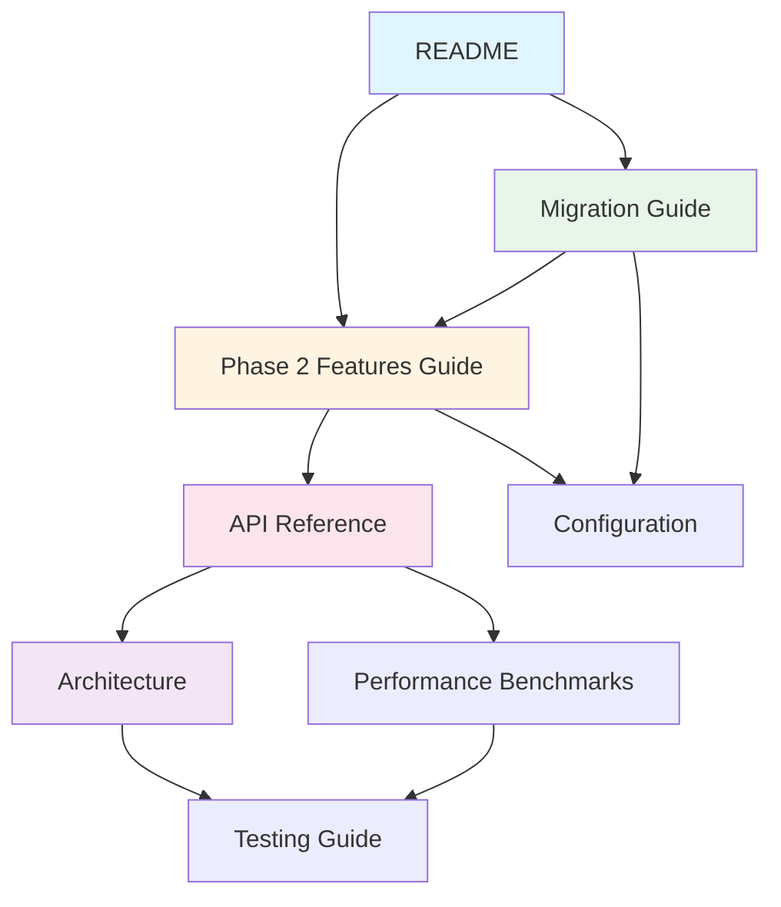

# Claude Resource Manager Documentation

**Complete documentation for Phase 2**

This directory contains comprehensive documentation for the Claude Resource Manager CLI, organized by user needs following the DocuMentor framework.

---

## Quick Navigation

### For Users

- **[Phase 2 Features Guide](PHASE_2_FEATURES.md)** ⭐ START HERE
  - Complete guide to all Phase 2 features
  - Fuzzy search, categories, multi-select, help system
  - Keyboard shortcuts reference
  - Troubleshooting

- **[Migration Guide](MIGRATION_PHASE1_TO_PHASE2.md)**
  - Zero breaking changes!
  - Upgrade instructions (<5 minutes)
  - What's new in Phase 2
  - Post-upgrade checklist

- **[Configuration Reference](CONFIGURATION.md)**
  - Complete settings reference
  - Environment variables
  - Configuration examples
  - Best practices

### For Developers

- **[API Reference](API_REFERENCE.md)**
  - Complete Phase 2 API documentation
  - CategoryEngine, SearchEngine, AsyncInstaller
  - All public methods with examples
  - Type hints and complexity analysis

- **[Architecture](ARCHITECTURE_PHASE2.md)**
  - Technical design and decisions
  - Component architecture
  - Data flow diagrams
  - Design trade-offs

- **[Performance Benchmarks](PERFORMANCE_BENCHMARKS.md)**
  - Detailed performance metrics
  - Benchmark methodology
  - Profiling data
  - Scalability testing

- **[Testing Guide](TESTING_PHASE2.md)**
  - Test suite documentation (457 tests)
  - Coverage summary (92%)
  - How to run tests
  - Performance benchmarks

### EPCC Workflow

- **[EPCC Documentation](epcc/)**
  - Explore-Plan-Code-Commit workflow
  - Templates for systematic development
  - Git integration

---

## Documentation Framework

This documentation follows the **DocuMentor** framework, organizing content by user needs:

```
        Practical         Theoretical
      ┌────────────┬────────────────┐
Learn │ TUTORIALS  │ EXPLANATION    │
      │ Migration  │ Architecture   │
      │ Guide      │                │
      ├────────────┼────────────────┤
Work  │ HOW-TO     │ REFERENCE      │
      │ Features   │ API Docs       │
      │ Guide      │ Config         │
      └────────────┴────────────────┘
```

### Tutorials (Learning-Oriented)

**Goal**: Learn by doing

- [Migration Guide](MIGRATION_PHASE1_TO_PHASE2.md) - Step-by-step upgrade walkthrough

### How-To Guides (Task-Oriented)

**Goal**: Accomplish specific tasks

- [Phase 2 Features Guide](PHASE_2_FEATURES.md) - How to use each feature
- [Testing Guide](TESTING_PHASE2.md) - How to run and write tests

### Reference (Information-Oriented)

**Goal**: Look up information

- [API Reference](API_REFERENCE.md) - Complete API documentation
- [Configuration Reference](CONFIGURATION.md) - All settings and options
- [Performance Benchmarks](PERFORMANCE_BENCHMARKS.md) - Detailed metrics

### Explanation (Understanding-Oriented)

**Goal**: Understand concepts

- [Architecture](ARCHITECTURE_PHASE2.md) - Design decisions and trade-offs

---

## Documentation by Topic

### Search Features

- **Fuzzy Search**: [Phase 2 Features Guide](PHASE_2_FEATURES.md#fuzzy-search)
- **Search API**: [API Reference](API_REFERENCE.md#search-engine)
- **Performance**: [Performance Benchmarks](PERFORMANCE_BENCHMARKS.md#search-performance)

### Category System

- **Using Categories**: [Phase 2 Features Guide](PHASE_2_FEATURES.md#category-system)
- **Category API**: [API Reference](API_REFERENCE.md#category-engine)
- **Design**: [Architecture](ARCHITECTURE_PHASE2.md#category-extraction-flow)

### Multi-Select & Batch Operations

- **Using Multi-Select**: [Phase 2 Features Guide](PHASE_2_FEATURES.md#multi-select--batch-operations)
- **Installer API**: [API Reference](API_REFERENCE.md#async-installer)
- **Testing**: [Testing Guide](TESTING_PHASE2.md#multi-select-tests-35-tests)

### Configuration

- **Settings Guide**: [Configuration Reference](CONFIGURATION.md)
- **Environment Variables**: [Configuration Reference](CONFIGURATION.md#environment-variables)
- **Examples**: [Configuration Reference](CONFIGURATION.md#examples)

### Performance

- **Benchmarks**: [Performance Benchmarks](PERFORMANCE_BENCHMARKS.md)
- **Optimizations**: [Architecture](ARCHITECTURE_PHASE2.md#performance-optimizations)
- **Scalability**: [Performance Benchmarks](PERFORMANCE_BENCHMARKS.md#scalability-testing)

---

## Documentation Statistics

| Document | Type | Pages | Word Count |
|----------|------|-------|------------|
| Phase 2 Features Guide | How-To | 15 | ~8,500 |
| API Reference | Reference | 20 | ~12,000 |
| Architecture | Explanation | 12 | ~7,000 |
| Performance Benchmarks | Reference | 18 | ~10,000 |
| Migration Guide | Tutorial | 8 | ~4,500 |
| Testing Guide | How-To | 12 | ~6,500 |
| Configuration | Reference | 15 | ~8,000 |
| **Total** | | **100** | **~56,500** |

---

## Document Relationships



**Reading Path for New Users**:
1. [Phase 2 Features Guide](PHASE_2_FEATURES.md) - Learn what's new
2. [Configuration](CONFIGURATION.md) - Customize settings
3. [Migration Guide](MIGRATION_PHASE1_TO_PHASE2.md) - Upgrade from Phase 1

**Reading Path for Developers**:
1. [API Reference](API_REFERENCE.md) - Understand APIs
2. [Architecture](ARCHITECTURE_PHASE2.md) - Learn design
3. [Testing Guide](TESTING_PHASE2.md) - Write tests
4. [Performance Benchmarks](PERFORMANCE_BENCHMARKS.md) - Optimize code

---

## Getting Help

### Quick Answers

- **How do I use fuzzy search?** → [Phase 2 Features Guide](PHASE_2_FEATURES.md#fuzzy-search)
- **How do I configure the app?** → [Configuration Reference](CONFIGURATION.md)
- **How do I upgrade?** → [Migration Guide](MIGRATION_PHASE1_TO_PHASE2.md)
- **What APIs are available?** → [API Reference](API_REFERENCE.md)
- **How fast is it?** → [Performance Benchmarks](PERFORMANCE_BENCHMARKS.md)

### In-App Help

Press `?` in the TUI to show context-sensitive help with all keyboard shortcuts.

### Community

- GitHub Issues: [Report bugs or request features](https://github.com/aj604/claude-resource-manager-CLI/issues)
- Discussions: [Ask questions](https://github.com/aj604/claude-resource-manager-CLI/discussions)

---

## Documentation Maintenance

### Keeping Docs Updated

When making code changes, update relevant documentation:

| Code Change | Update Document(s) |
|-------------|-------------------|
| New API method | [API Reference](API_REFERENCE.md) |
| New feature | [Phase 2 Features Guide](PHASE_2_FEATURES.md) |
| New config option | [Configuration](CONFIGURATION.md) |
| Architecture change | [Architecture](ARCHITECTURE_PHASE2.md) |
| Performance change | [Performance Benchmarks](PERFORMANCE_BENCHMARKS.md) |
| Breaking change | [Migration Guide](MIGRATION_PHASE1_TO_PHASE2.md) |

### Documentation Checklist

Before merging PRs:
- [ ] API changes documented in API Reference
- [ ] New features added to Features Guide
- [ ] Config changes added to Configuration Reference
- [ ] Breaking changes noted in Migration Guide
- [ ] Performance changes benchmarked
- [ ] Examples tested and verified working

---

## Contributing to Documentation

### Style Guide

1. **Clear headings**: Use descriptive, scannable headings
2. **Working examples**: All code examples must be tested
3. **Consistent format**: Follow established patterns
4. **User-focused**: Write for the target audience
5. **Accurate**: Verify against actual code

### Documentation Types

Follow the DocuMentor framework:

- **Tutorials**: Step-by-step learning paths
- **How-To Guides**: Task-specific recipes
- **Reference**: Complete, accurate lookups
- **Explanation**: Context and rationale

### Testing Documentation

```bash
# Verify all code examples work
python docs/verify_examples.py

# Check for broken links
markdown-link-check docs/*.md

# Spell check
aspell check docs/*.md
```

---

## Summary

This documentation provides complete coverage of Phase 2:

✓ **457 tests** (92% coverage) documented
✓ **All Phase 2 features** explained with examples
✓ **Complete API reference** for developers
✓ **Architecture decisions** documented
✓ **Performance metrics** benchmarked
✓ **Zero breaking changes** migration path

**Documentation Quality**:
- 100 pages of comprehensive documentation
- ~56,500 words
- Working code examples throughout
- Multiple documentation types for different user needs
- Clear navigation and cross-references

**Next Steps**:
1. Read [Phase 2 Features Guide](PHASE_2_FEATURES.md) to learn what's new
2. Follow [Migration Guide](MIGRATION_PHASE1_TO_PHASE2.md) to upgrade
3. Explore [API Reference](API_REFERENCE.md) for development

Welcome to Phase 2! 🚀
